<h1 align="center">操作系统lab1实验报告</h1>

<h5 align="center">实验名称：Lab 1: 最小可执行内核  完成日期：2026-10-07</h5 align="center">
<h5 align="center">小组成员：2411264-张远、2414099-李云鹏、2413074-刘昀皓</h5 align="center">


# 小组分工

| 成员 | 负责的练习/模块/代码/报告 |
|------|----------------|
| 2411264-张远 | 练习 2（GDB 验证启动流程）、实验整体逻辑分析、报告集成 |
| 2414099-李云鹏 | 练习 1（内核入口）、功能模块（链接脚本与内存布局、格式化输出与 SBI、构建与镜像加载）、对操作系统的理解 |
| 2413074-刘昀皓 | 实验目的、实验环境、测试与验证、拓展（现代笔记本的启动流程）、实验总结 |


# 一、实验目的

> **【待补】实验目的（T6，nagilix）** <!-- fill:T6-*purpose*.md -->


# 二、实验环境

> **【待补】实验环境表（T6，nagilix）** <!-- fill:T6-*env*.md -->


# 三、整体分析

## 3.1 逻辑主线

Lab1 的主题是**最小可执行内核**：让一段我们自己编写的代码在一台“什么都没有”的 RISC-V 机器上拿到 CPU，并且能向外界输出信息。所谓“什么都没有”，是指这时既没有操作系统替我们装载程序，也没有 C 标准库和现成的栈。整个实验要回答的问题是：**在这样的条件下，内核怎样被放到正确的位置、从正确的指令开始执行、获得能运行 C 代码的环境，并且与外界交互？**

我们认为本章可以概括成一句话：**控制权的接力**。加电后，控制权依次经过 QEMU 生成的复位代码、OpenSBI 固件、内核入口 `entry.S` 和 C 函数 `kern_init`，最后通过 SBI 服务把字符送到串口。每一棒都要替下一棒准备好条件：复位代码交出固件的入口和启动参数，OpenSBI 设置好特权级和入口地址，`entry.S` 提供可用的栈，`kern_init` 清零未初始化的全局数据。

## 3.2 功能的逐步分析

Lab1 不要求编写新代码，我们更多进行分析。下表列出了启动每一步对应的代码和报告中的分析位置：

| 顺序 | 功能 | 主要代码 | 报告中的分析 |
|------|------|----------|--------------|
| 1 | 确定内核的形态和地址 | `Makefile`、`tools/kernel.ld` | 功能模块「链接脚本与内核内存布局」「构建与镜像加载」 |
| 2 | 装载与固件交接：把控制权交给内核 | QEMU 复位代码、OpenSBI | 练习 2 |
| 3 | 入口建栈：为 C 代码准备栈 | `kern/init/entry.S` | 练习 1 |
| 4 | C 运行环境初始化：清零 BSS | `kern/init/init.c` | 练习 1、功能模块「链接脚本与内核内存布局」 |
| 5 | 格式化输出：通过 SBI 向终端打印 | `kern/libs/stdio.c`、`libs/printfmt.c`、`libs/sbi.c` | 功能模块「格式化输出与 SBI 服务」、练习 2 第六节 |

1. **首先是构建与链接。** 内核运行之前，必须先确定它“长什么样、放在哪”：链接脚本规定 `.text` 从 `0x80200000` 开始，各段按代码、只读数据、数据、BSS 的顺序排列，`entry.o` 排在链接输入的最前面，保证 `kern_entry` 正好位于起始地址。后面所有步骤都以这些约定为前提，所以它排在第一位。

2. **接着是装载与固件交接。** QEMU 在 CPU 开始执行之前就按 ELF 把内核放到了 `0x80200000`；CPU 从 `0x1000` 的复位代码开始执行，跳到 `0x80000000` 的 OpenSBI。OpenSBI 在 M 态完成平台初始化，配置好异常委托和 PMP 内存保护，最后用 `mret` 降到 S 态，跳到内核入口。只有到了这一步，内核才第一次真正拿到 CPU。

3. **然后是入口建栈。** 内核拿到 CPU 时，`sp` 仍然指向 OpenSBI 自己的栈，而那块内存已经被 PMP 设置为 S 态不可访问。C 函数需要用栈保存返回地址和局部变量，所以 `entry.S` 的第一件事就是 `la sp, bootstacktop`，换成内核在 `.data` 段中预留的 8 KB 启动栈，然后用 `tail kern_init` 跳进 C 代码。这一步只能用汇编完成，因为在栈准备好之前，C 代码根本无法正确运行。

4. **再是 C 运行环境的初始化。** 进入 `kern_init` 后，第一件事是 `memset(edata, 0, end - edata)`，把 BSS 区清零，满足 C 语言“未初始化的全局变量为 0”的约定。`edata` 和 `end` 由链接脚本提供，这一步又一次用到了第 1 步的约定。（在我们的构建中 BSS 恰好为空，清零长度为 0，但这一步对一般的内核仍然是必需的。）

5. **最后是格式化输出。** `cprintf` 把格式化工作交给 `vprintfmt`，每生成一个字符就经 `cputch → cons_putc → sbi_console_putchar` 送出。最后一层用 `ecall` 陷入 M 态，由 OpenSBI 的串口驱动把字符写到 UART。输出放在最后，是因为它依赖前面所有步骤：需要可用的栈、已初始化的全局变量，还需要 OpenSBI 已经注册好 SBI 服务。

6. 打印完信息后，`kern_init` 进入 `while(1)` 死循环。此时内核还没有中断处理、内存管理和进程调度，能做的事情也就到此为止。

   


# 四、实验内容与实现

## 练习1：理解内核启动中的程序入口操作

**负责人：** 2414099－李云鹏（lyp）

进入内核后，`entry.S` 先执行 `la sp, bootstacktop`，再执行 `tail kern_init`。这两句分别解决栈和控制流的问题：先给 C 函数准备能用的栈，再跳到 C 语言入口。

### 1. `la sp, bootstacktop` 做了什么

先看启动栈的定义：

```asm
.section .data
    .align PGSHIFT
    .global bootstack
bootstack:
    .space KSTACKSIZE
    .global bootstacktop
bootstacktop:
```

`mmu.h` 中 `PGSHIFT=12`、`PGSIZE=4096`，`memlayout.h` 中 `KSTACKPAGE=2`。因此 `.align PGSHIFT` 使栈按 4096 字节对齐，`.space KSTACKSIZE` 预留 8192 字节。`bootstack` 和 `bootstacktop` 分别标记这块空间的低地址端和高地址端。

`la` 加载的是 `bootstacktop` 的地址。执行后，`sp` 指向预留区域的高地址端；RISC-V 栈向低地址增长，后面的函数通过减小 `sp` 留出栈帧。这里没有动态申请内存：栈空间已经由汇编和链接阶段安排好，入口只需让 `sp` 指向它。

进入 `kern_init` 后，编译器会生成分配栈帧、保存返回地址的指令，后续 `cprintf` 也会使用栈。因此**入口要先建立内核自己的栈**，不能沿用仍指向固件区域的 `sp`。

本机用 SiFive GCC 10.2.0 构建了同一份代码，`nm` 得到：

```text
0000000080201000 D bootstack
0000000080203000 D bootstacktop
```

所以栈区域是 `[0x80201000,0x80203000)`，共 8 KiB；初始 `sp=0x80203000`，也满足 ABI 的 16 字节对齐要求。

下面是本机重新运行 GDB 后的输出。截图取自批处理原始输出的展示页：`sp` 从 `0x80017ee0` 变为 `0x80203000`，执行 `tail` 后 PC 到达 `kern_init`，`ra` 仍为 `0x800078cc`。

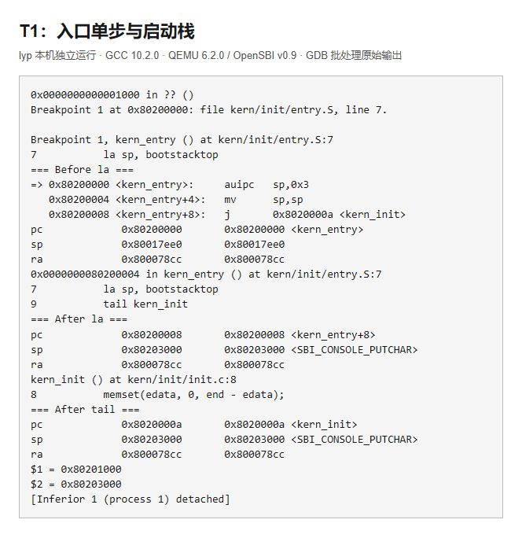

<center>图 1　启动栈设置和尾跳转的 GDB 输出（lyp 本机，QEMU 6.2.0 / OpenSBI v0.9）</center>

### 2. 为什么一条 `la` 要单步两次

在最终 ELF 中，入口的反汇编为：

```text
80200000: 00003117    auipc sp,0x3
80200004: 00010113    mv    sp,sp
80200008: a009        j     8020000a <kern_init>
```

`la` 是伪指令，前两条才是它实际对应的机器指令。`auipc` 用当前 PC 加上高位偏移，得到 `0x80200000 + (3 << 12) = 0x80203000`；第二条补低位偏移。这次低位恰好为零，所以 `addi sp,sp,0` 被反汇编显示成 `mv sp,sp`。加上 `-M no-aliases` 就能看到原指令。

GDB 按机器指令单步，所以检查 `la` 的执行结果时要执行两次 `si`，才能到下一行源码。

### 3. `tail kern_init` 做了什么

`tail` 跳到 `kern_init`，且不为这次跳转保存返回地址。普通 `call` 会更新 `ra`，以便函数结束后回到调用点；这里启动入口不再需要继续执行，直接把控制权交给内核初始化函数即可。

检查未链接的 `entry.o`，`tail` 对应带重定位的 `auipc t1,...` 和 `jalr x0,0(t1)`。链接后，目标很近，链接器把这两条松弛成一条16位的 `c.j`，默认显示为上面的 `j`。因此要分清两个层次：伪指令表达的是不保存返回地址的跳转，最终使用哪几条机器指令还取决于链接结果。

本机在 GDB 中执行完 `la`、再执行完 `tail`，得到以下记录，使用的固件是 OpenSBI v0.9：

| 时刻 | PC | sp | ra |
|---|---|---|---|
| 执行完 `la` | `0x80200008` | `0x80203000` | `0x800078cc` |
| 执行完 `tail` | `0x8020000a` | `0x80203000` | `0x800078cc` |

`PC` 已到 `kern_init`，`sp` 和 `ra` 都没有变化。`tail` 本身不会清理栈；当前入口也没有建立需要清理的栈帧。

`kern_init` 的声明带有 `__attribute__((noreturn))`，告诉编译器这个函数不会返回。实际代码在清零和打印之后执行 `while (1)`，这才保证它不会走回调用者。`noreturn` 是编译约定，不是让函数无法返回的硬件机制。

### 4. 为什么启动栈放在 `.data`

`kern_init` 开始时执行：

```c
    extern char edata[], end[];
    memset(edata, 0, end - edata);
```

链接脚本把 `edata` 放在 `.data/.sdata` 之后，把 `end` 放在 `.bss` 之后。这段代码清零 `[edata,end)`，为未显式初始化的静态变量建立零值。

调用 `memset` 时，启动栈已经在使用了。如果把栈直接移到这个会被整体清零的 BSS 区间，清零可能覆盖栈上保存的返回地址和数据。放在 `.data` 后，启动栈位于 `edata` 之前，不会被这次清零碰到；相应地，预留的零字节也会占用镜像空间。

本次 `nm` 中 `edata` 和 `end` 都是 `0x80203008`，说明当前没有存活的非空 BSS，调用长度为零。这里解释的是这段启动代码的用途，而本次构建还没有数据需要它清零。


## 练习2：使用 GDB 验证启动流程

**负责人：** openfar

> **题目**：使用 GDB 跟踪 QEMU 模拟的 RISC-V 从加电开始，直到执行内核第一条指令（跳转到 0x80200000）的整个过程。RISC-V 硬件加电后最初执行的几条指令位于什么地址？它们主要完成了哪些功能？

**结论**：加电后 CPU 处于 M 态（机器模式），PC 被复位到 **0x1000**。这里是 QEMU 在 MROM 中生成的复位代码，一共 6 条指令，作用是为下一阶段准备三个参数（`a0` = hart 编号，`a1` = 设备树地址，`a2` = 启动信息结构 `fw_dynamic_info` 的地址），然后跳转到 **0x80000000** 处的 OpenSBI 固件。OpenSBI 在 M 态完成平台初始化，最后通过一条 `mret` 指令降到 S 态（监管者模式），并跳转到 **0x80200000** 执行内核的 `kern_entry`。下面各节的每个结论都来自实际的 GDB 输出。


### 一、背景：启动链上的三个角色

RISC-V 有三个常用的特权级：**M 态**（Machine）权限最高，可以访问一切硬件；**S 态**（Supervisor）运行操作系统内核；**U 态**（User）运行用户程序。CPU 加电时处于 M 态，内核运行在 S 态，所以在两者之间需要一个运行在 M 态的固件来交接，这个固件就是 **OpenSBI**。它在启动时完成硬件初始化，然后把 CPU 降到 S 态交给内核；内核运行期间，它常驻在 M 态，为内核提供输出字符、设置定时器等与平台相关的服务。内核通过 `ecall` 指令请求这些服务，这套 S 态与 M 态之间的调用约定称为 **SBI**（Supervisor Binary Interface）。

整个启动过程可以概括为下图：左边是这几个参与者在物理内存中的位置，右边是控制权在它们之间的传递顺序。

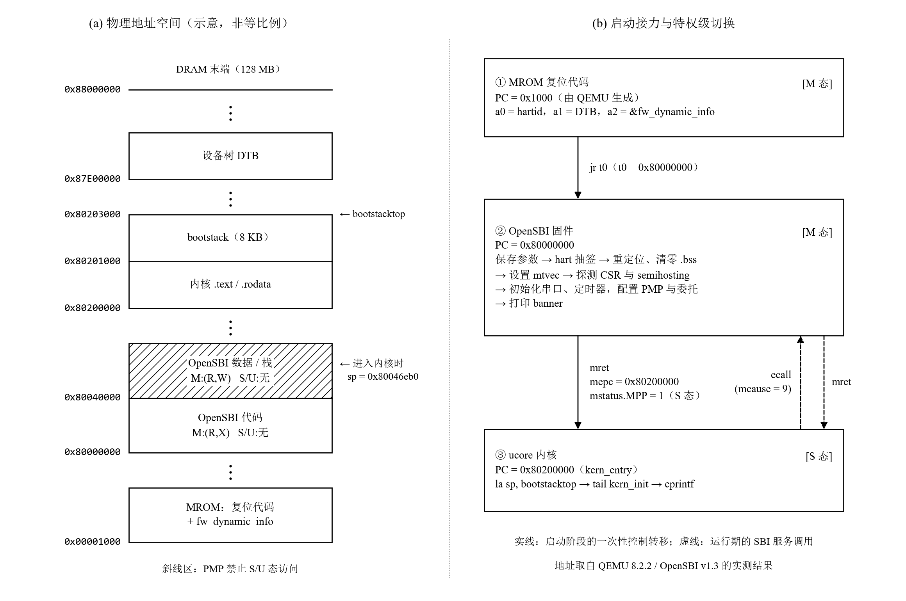

<center>图 2　lab1 的启动流程与物理内存布局</center>

调试环境为 WSL Ubuntu，QEMU 8.2.2（自带 OpenSBI v1.3），GDB 使用 `riscv64-unknown-elf-gdb`。


### 二、阶段一：复位与 MROM（0x1000）

GDB 连上之后，先确认 CPU 的初始状态，再反汇编 PC 处的指令，并查看紧跟在指令后面的数据区：

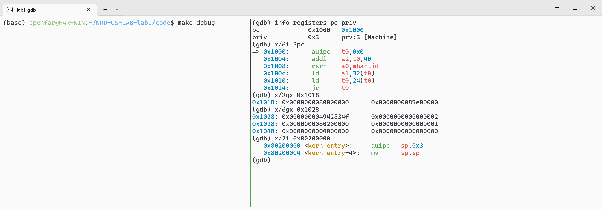

<center>图 3　复位后的第一条指令位于 0x1000，CPU 处于 M 态</center>

`priv` 为 3，表示 CPU 处于 M 态；PC 是 0x1000，这里只有 6 条指令。逐条单步并观察寄存器，各条指令的作用如下：

| 地址 | 指令 | 作用 | 执行后 |
|------|------|------|--------|
| 0x1000 | `auipc t0,0x0` | 取当前 PC 作为基址，方便后面按相对地址取数据 | t0 = 0x1000 |
| 0x1004 | `addi a2,t0,40` | a2 = `fw_dynamic_info` 的地址 | a2 = 0x1028 |
| 0x1008 | `csrr a0,mhartid` | a0 = 当前 hart 的编号 | a0 = 0 |
| 0x100c | `ld a1,32(t0)` | 从 0x1020 读出设备树地址 | a1 = 0x87e00000 |
| 0x1010 | `ld t0,24(t0)` | 从 0x1018 读出固件入口 | t0 = 0x80000000 |
| 0x1014 | `jr t0` | 跳转到 OpenSBI | pc = 0x80000000，仍处于 M 态 |

图中 `x/2gx 0x1018` 和 `x/6gx 0x1028` 读出的是 QEMU 填在指令后面的数据。`fw_dynamic_info` 的 6 个字段依次是 magic（`0x4942534f`，即 ASCII 的 "OSBI"）、版本号 2、**下一阶段入口 next_addr = 0x80200000**、**下一阶段特权级 next_mode = 1（S 态）**、选项 0 和启动 hart 编号 0。OpenSBI 之所以知道内核在哪里、应该以什么特权级运行内核，靠的就是这张由 QEMU 填写、经 a2 传过去的表。

图中最后一条命令 `x/2i 0x80200000` 显示，**此时内核的第一条指令已经在 0x80200000 了**，而 CPU 一条指令都还没有执行。这个现象在第五节会进一步讨论。

> **版本差异**：在课程推荐的 QEMU 4.1 中（见其源码 `hw/riscv/virt.c`），复位代码只有 5 条指令，不设置 a2；配套的 OpenSBI 是 fw_jump 型，下一阶段地址在编译时就固定为 0x80200000，不需要 QEMU 传参。新版 QEMU 改用 fw_dynamic 型固件，入口地址改由 QEMU 动态传入，这也是原框架 Makefile 在新版 QEMU 上无法启动内核的原因（见「对实验框架的修改」一节）。


### 三、阶段二：OpenSBI 的初始化（0x80000000）

`jr t0` 之后，PC 来到 0x80000000。OpenSBI 入口处的指令与它的源码 `firmware/fw_base.S` 中的 `_start` 一一对应：

```
=> 0x80000000:	add	s0,a0,zero        ← 把 MROM 传来的 a0/a1/a2 保存到 s0/s1/s2
   0x80000004:	add	s1,a1,zero
   0x80000008:	add	s2,a2,zero
   0x8000000c:	jal	0x80000580        ← fw_boot_hart：从 fw_dynamic_info 中读出启动 hart
   ...
   0x80000034:	amoadd.w a6,a7,(a6)    ← 启动抽签：多核时只有第一个完成原子加的 hart 负责初始化
   0x80000038:	bnez	a6,0x800000da     ← 其余 hart 转去等待
```

此后 OpenSBI 还要完成一系列初始化，最后打印 banner 并跳转到内核。但 QEMU 自带的 OpenSBI 固件没有符号表，所以我们先从源码编译一份带符号的 OpenSBI，按函数名跟踪完整的初始化流程。

#### 3.1 用带符号的 OpenSBI 跟踪初始化流程

QEMU 8.2.2 自带的是 OpenSBI v1.3（banner 第一行）。我们从官方仓库取出 v1.3 的源码，按 QEMU 使用的配置（`PLATFORM=generic`，fw_dynamic 型）编译。

下图在 `sbi_hart_init`（探测 CPU 特性）和 `sbi_hart_switch_mode`（交接给内核）两处断下：

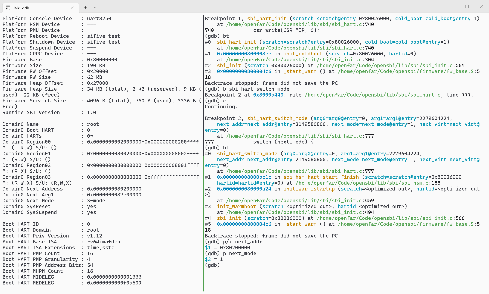

<center>图 4　带符号的 OpenSBI：sbi_hart_init 的调用栈，以及交接函数 sbi_hart_switch_mode 的参数</center>

`sbi_hart_switch_mode` 的参数就是交接信息：`arg0 = 0`（hart 编号）、`arg1 = 2279604224`（即 0x87e00000，设备树地址）、`next_addr = 0x80200000`、`next_mode = 1`（S 态），与 MROM 通过 `fw_dynamic_info` 传入的内容一致。

在各个关键函数上设断点并依次运行，得到 OpenSBI 从入口到交接的完整流程：

| 阶段 | 函数 | 作用 |
|------|----------------|------|
| asm | `_start`（firmware/fw_base.S） | 把 MROM 传来的 a0/a1/a2 保存到 s0/s1/s2 |
| | `fw_boot_hart`（firmware/fw_dynamic.S） | 从 `fw_dynamic_info` 中读出由哪个 hart 负责启动 |
| | 启动抽签、重定位检查、清零 .bss | 多核时选出唯一的冷启动 hart，并准备好 OpenSBI 自身的内存 |
| | `fw_save_info`（firmware/fw_dynamic.S） | 保存 next_addr、next_mode 等交接信息 |
| | `fw_platform_init`（platform/generic/platform.c） | 解析设备树（参数 arg1 = 0x87e00000），得到 hart 数量、内存范围、串口等平台信息 |
| | 设置每个 hart 的 scratch 区和栈，`mtvec = _trap_handler` | 为 C 代码准备运行环境，并设置 M 态的陷阱入口 |
| | `_start_warm → sbi_init`（lib/sbi/sbi_init.c） | 进入 C 代码，冷启动 hart 执行 `init_coldboot` |
| C | `sbi_scratch_init` | 初始化每个 hart 的私有数据区 |
| | `sbi_heap_init` | 初始化 OpenSBI 内部的小堆（banner 中的 Heap） |
| | `sbi_domain_init` | 建立 root 域，划定各内存区域及其访问权限 |
| | `sbi_hsm_init` | 初始化 hart 状态管理（HSM），之后内核可以通过 SBI 启停其他 hart |
| | `sbi_hart_init` | 探测 CPU 特性：PMP 表项数、性能计数器数量和若干可选扩展 |
| | `sbi_console_init` | 初始化 uart8250 串口，从此可以打印；其间还会探测 semihosting |
| | `sbi_pmu_init` / `sbi_irqchip_init` / `sbi_ipi_init` / `sbi_tlb_init` / `sbi_timer_init` | 依次初始化性能计数器、中断控制器、核间中断、远程 TLB 刷新和定时器 |
| | `sbi_domain_finalize` | 确定域的最终配置，包括下一阶段的入口地址和特权级 |
| | `sbi_hart_pmp_configure` | 写 PMP 寄存器，禁止 S/U 态访问 OpenSBI 自己的内存 |
| | `sbi_ecall_init` | 注册各类 SBI 服务（控制台、定时器、核间中断等），供内核用 `ecall` 调用 |
| | `sbi_boot_print_*` | 打印 banner，其中 MIDELEG/MEDELEG 两行由 `sbi_hart_delegation_dump` 打印 |
| 交接 | `sbi_hsm_hart_start_finish → sbi_hart_switch_mode` | 设置 `mstatus.MPP` 和 `mepc`，执行 `mret` 进入 S 态 |

需要说明的是，这份固件与 QEMU 自带的固件**逻辑相同，但内存布局不同**：前者大小为 190 KB，读写区从 0x80020000 开始；后者为 322 KB，读写区从 0x80040000 开始。因此函数地址、寄存器分配等细节不同。本节其余部分都以 QEMU 自带的固件为准。

#### 3.2 七次 mret

不论使用哪份固件，OpenSBI 把控制权交给内核时，都必须用 `mret` 完成从 M 态到 S 态的切换。

对于没有符号的自带固件，我们先用 `objdump` 反汇编，找出其中全部 5 条 `mret` 指令，在这些地址上都设置断点，并让 GDB 在每次命中时自动打印 `mepc`（mret 将要跳往的地址）和 `mstatus.MPP`（mret 将要切换到的特权级），然后继续运行：

```
mret#1 @0x8000c67a : mepc=0x80009576 MPP=3 mcause=0x2 mtval=0x3c002873
mret#2 @0x8000c67a : mepc=0x8000aa2e MPP=3 mcause=0x2 mtval=0xb1302873
mret#3 @0x8000c67a : mepc=0x8000a412 MPP=3 mcause=0x2 mtval=0xda002573
mret#4 @0x8000c67a : mepc=0x8000a456 MPP=3 mcause=0x2 mtval=0xfb002573
mret#5 @0x8000c67a : mepc=0x8000a4aa MPP=3 mcause=0x2 mtval=0x30c02673
mret#6 @0x8000d910 : mepc=0x8000d928 MPP=3 mcause=0x3 mtval=0
mret#7 @0x8000aec8 : mepc=0x80200000 MPP=1 mcause=0x3 mtval=0
  ^ 这次 mret 跳往内核。medeleg=0xf0b509 mideleg=0x1666 a0=0 a1=0x87e00000
```

`mret` 一共执行了 7 次，只有最后一次是交给内核的。

- **第 1～5 次**（mcause = 2，非法指令）：发生在 `sbi_hart_init` 中。OpenSBI 在**探测 CPU 实现了哪些 CSR**：故意读取可能不存在的 CSR（PMP 地址寄存器、性能计数器和几个可选扩展的寄存器），触发非法指令异常就说明该 CSR 不存在。

- **第 6 次**（mcause = 3，断点）：断点前后的代码是 `slli zero,zero,0x1f; ebreak; srai zero,zero,0x7`，这是 RISC-V **semihosting**（让被调试程序借用宿主机输入输出的机制）的固定指令序列。`semihosting_enabled()` 先临时替换 `mtvec`，再执行一次 `ebreak`：如果调试器或模拟器接管了这个 ebreak，就说明 semihosting 可用。QEMU 没有开启 semihosting，所以产生了断点异常，处理代码把 mepc 加 4 后返回；OpenSBI 因此改用 uart8250 串口作为控制台，也不会调用 `semihosting_init`。
- **第 7 次**（MPP = 1）：在 `sbi_hart_switch_mode` 中，**从 M 态进入 S 态，把控制权交给内核**。


### 四、阶段三：mret 交接与进入内核（0x80200000）

我们单独在第 7 次 mret 的地址 0x8000aec8 处下断点，观察交接的完整过程：

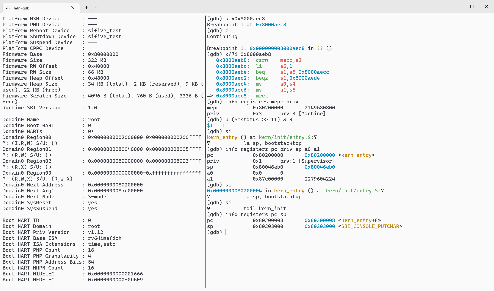

<center>图 5　OpenSBI 通过 mret 把控制权交给内核（左栏为此时已打印的 OpenSBI banner）</center>

右栏自上而下可以看到交接的全过程：

1. **交接前的准备**：`x/7i` 显示 mret 前面的几条指令，`csrw mepc,s3` 把 mepc 设为下一阶段的入口，`mv a0,s4` / `mv a1,s5` 准备传给内核的两个参数。它前面还有一条 `csrw mstatus`，用来把 MPP 设为 S 态。这段逻辑与 OpenSBI 源码中的 `sbi_hart_switch_mode()` 一致。此时 `mepc = 0x80200000`，`mstatus.MPP = 1`，CPU 仍处于 M 态。
2. **执行 mret**：`si` 之后 PC 跳到 `kern_entry`，`priv` 变为 1，即 **S 态**。这就是**跳转到 0x80200000**的确切时刻和方式。
3. **内核看到的初始状态**：`a0 = 0` 是 hart 编号，`a1 = 0x87e00000` 指向设备树。值得注意的是 **`sp = 0x80046eb0`，仍然是 OpenSBI 自己的栈**。左栏的 banner 显示，`0x80040000-0x8005ffff`（Domain0 Region01）对 S/U 态没有任何权限（`S/U: ()`），访问会被 PMP 拦截。所以内核如果直接用这个 sp 压栈，就会触发访问异常。这从另一个角度说明了练习 1 中 `la sp, bootstacktop` 为什么必须是内核的第一件事。
4. **切换到内核栈**：再单步两条指令（`la` 伪指令展开成 `auipc` + `mv` 两条），`sp` 变为 `0x80203000`，即 `bootstacktop`。
5. 之后继续执行  `entry.S` 和 `init.c`


### 五、关于指导书提示的勘误

指导书的提示称“SBI 固件进行主初始化，其核心任务之一是将内核加载到 0x80200000，可以使用 `watch *0x80200000` 观察内核加载瞬间”。我们按提示做了实验：

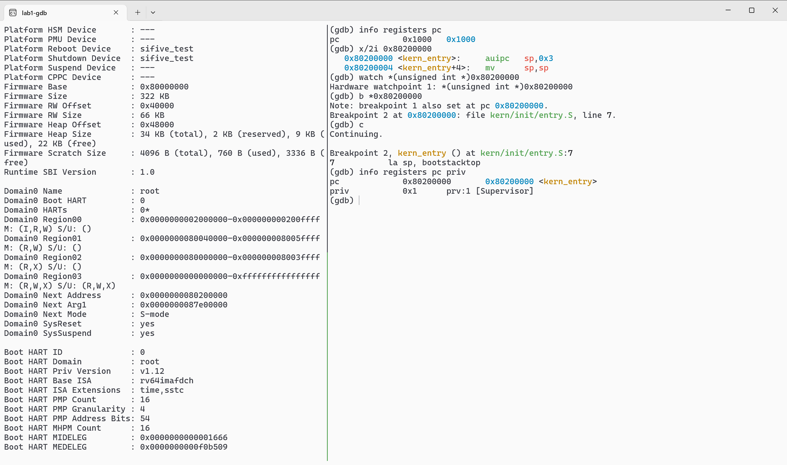

<center>图 6　在 0x1000 处设置 watchpoint，运行后只命中了内核入口的断点</center>

GDB 停在 0x1000 时，0x80200000 处已经是 `kern_entry` 的指令；设置硬件 watchpoint 后继续运行，直接命中了内核入口的断点，watchpoint 从未被触发。

原因在于，**内核不是由 OpenSBI 加载的，而是 QEMU 在虚拟机复位、CPU 开始执行之前就直接写进了模拟内存**（`-kernel` 和 `-device loader` 两种参数都是这样）。OpenSBI 只负责跳转，不负责加载，所以 watch point 不被触发。同理，提示中说 0x1000 处执行的是“OpenSBI 的汇编代码”也不准确：0x1000 处是 QEMU 生成的 MROM 复位代码，OpenSBI 从 0x80000000 才开始执行。

那么在**真实硬件**上，内核是由谁加载的？以 SiFive HiFive Unmatched、StarFive VisionFive 2 等常见 RISC-V 开发板为例，典型的启动链是：

```
片上 ROM（ZSBL） → U-Boot SPL → OpenSBI（M 态） → U-Boot（S 态） → Linux 内核（S 态）
```

片上 ROM 从 SPI Flash 或 SD 卡读入 U-Boot SPL；SPL 初始化 DRAM 后，把 OpenSBI 和 U-Boot 一并读入内存；OpenSBI 完成 M 态初始化后跳转到 U-Boot；U-Boot 具备存储、文件系统和网络驱动，由它从磁盘或网络读入内核镜像和设备树，再跳转到内核。可见，在真机上 OpenSBI 同样**只负责初始化和跳转，不负责从存储设备读取内核**：它本身没有磁盘和文件系统驱动，“加载”是由它前后的引导程序（SPL、U-Boot）完成的。QEMU 实验中把这些引导程序都省掉了，由 QEMU 自己完成“读入内存”这一步。


### 六、延伸：内核如何使用 OpenSBI 的服务

内核启动后，OpenSBI 并没有退场。`kern_init` 调用 `cprintf` 输出字符串，最终会走到 `sbi_console_putchar` 中的 `ecall`。我们在这条 `ecall` 上下断点：

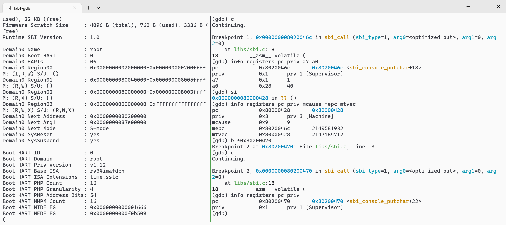

<center>图 7　内核第一次调用 SBI：S 态 ecall 陷入 M 态，处理完成后返回</center>

- 断下时 CPU 处于 S 态，`a7 = 1` 是 SBI 调用号 `SBI_CONSOLE_PUTCHAR`，`a0 = 0x28` 是要输出的字符 `(`，也就是 `(THU.CST) os is loading ...` 的第一个字符。
- 执行 `ecall` 后，PC 跳到 `mtvec` 指向的 0x80000428（OpenSBI 的陷阱入口），特权级变为 M 态，`mcause = 9` 表示“来自 S 态的 ecall”，`mepc` 记录了 ecall 的地址，以便返回。
- OpenSBI 处理完请求后用 `mret` 返回，内核从 `ecall` 的下一条指令（0x80200470）继续执行，特权级恢复为 S 态。此时左栏 QEMU 的输出中出现了一个 `(`，正是这次调用输出的字符。

这说明 `cprintf` 能在终端上显示文字，是因为内核把“向串口写字符”这件事委托给了 M 态的固件，内核自己并不直接操作串口

借助带符号的固件，还可以看到 OpenSBI 内部是怎样处理这次调用的。我们换上带符号的固件，先运行到内核入口，再在串口驱动的输出函数 `uart8250_putc` 上下断点：

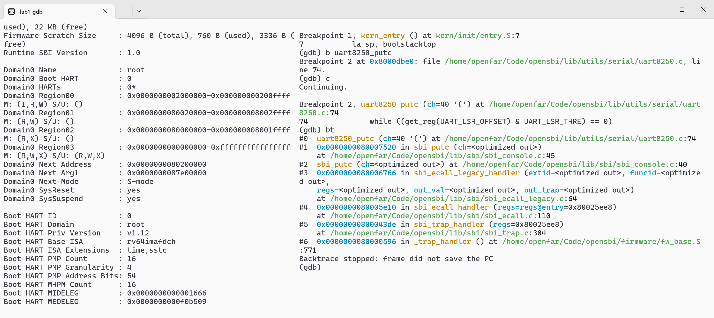

<center>图 8　内核的 ecall 在 OpenSBI 内部的处理链，最终由 uart8250_putc 写出字符 '('</center>

调用栈自下而上依次是：

```
_trap_handler          (fw_base.S)        保存内核的寄存器现场
 → sbi_trap_handler    (sbi_trap.c)       按 mcause = 9 判定为来自 S 态的 ecall
 → sbi_ecall_handler   (sbi_ecall.c)      按 a7 = 1 找到对应的 SBI 扩展
 → sbi_ecall_legacy_handler (sbi_ecall_legacy.c)  CONSOLE_PUTCHAR 属于 SBI v0.1 的旧式调用
 → sbi_putc            (sbi_console.c)    控制台抽象层
 → uart8250_putc('(')  (uart8250.c)       等待发送寄存器空闲，把字符写入 UART
```

可见从内核的一条 `ecall` 到字符真正出现在终端上，中间经过了 OpenSBI 的陷阱入口、SBI 调用分发和串口驱动三层。内核只需要知道“调用号 1 表示输出一个字符”，串口是什么型号、寄存器在哪个地址，这些平台细节都由 OpenSBI 屏蔽了。这正是 SBI 作为**内核与固件之间的接口**的意义。


## 功能模块：链接脚本与内核内存布局

**负责人：** 2414099－李云鹏（lyp）

### 模块功能描述

`kernel.ld` 把各目标文件的代码和数据组织成内核 ELF，确定入口及各段的地址。本实验分析已有配置，不需要新增函数。

```ld
OUTPUT_ARCH(riscv)
ENTRY(kern_entry)

BASE_ADDRESS = 0x80200000;
```

`ENTRY(kern_entry)` 指定 ELF 的入口字段，`. = BASE_ADDRESS` 则让接下来的 `.text` 从 `0x80200000` 开始。二者不是同一件事：入口字段告诉装载器从哪里执行，位置计数器决定链接布局。

为什么 `kern_entry` 恰好在最前面？`entry.S` 使用的是普通 `.text`，而 `make print-kobjs` 输出的第一个文件是 `obj/kern/init/entry.o`，之后才是 `init.o`、`stdio.o` 等。链接器收集这些输入节时，先放入 `entry.o` 的入口代码，所以 `kern_entry` 的地址就是 `.text` 的起点。仅有 `ENTRY` 并不会把这个函数移到最前面。

脚本按 `.text → .rodata → 页对齐 → .data → .sdata → .bss` 排列。用 SiFive GCC 10.2.0 构建后，`readelf -S` 和 `nm` 的结果如下：

| 区域 | 地址范围（左闭右开） | 本次内容 |
|---|---|---|
| `.text` | `[0x80200000,0x802004c8)` | 入口和函数机器码 |
| `.rodata` | `[0x802004c8,0x80200738)` | 字符串和格式化所需的只读数据 |
| 对齐空隙 | `[0x80200738,0x80201000)` | 后续数据按4 KiB对齐 |
| `.data` | `[0x80201000,0x80203000)` | 8 KiB启动栈 |
| `.sdata` | `[0x80203000,0x80203008)` | `SBI_CONSOLE_PUTCHAR` |
| BSS清零区间 | `[0x80203008,0x80203008)` | 空区间，`edata=end` |

下面的 `nm` 输出中可以直接核对入口、栈和数据边界。图为本机命令原始输出展示页的截图。

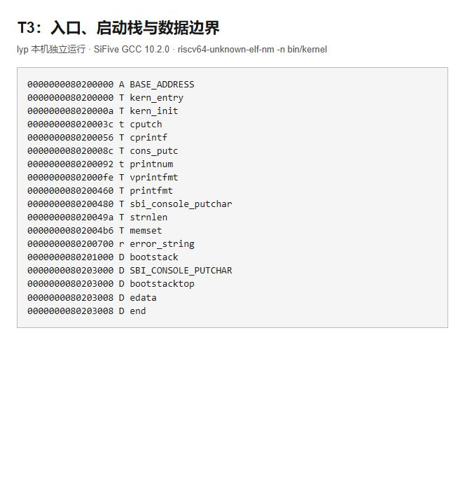

<center>图 9　kern_entry、启动栈和数据边界的符号地址</center>

`bootstacktop` 和 `SBI_CONSOLE_PUTCHAR` 同为 `0x80203000`，看起来像栈与变量重叠，实际没有冲突：前者是栈区域结束的标签，栈不包含这一边界字节，后者从这里开始占用空间。

脚本还定义了三个边界：`etext` 在 `.text` 之后，`edata` 在 `.data/.sdata` 之后，`end` 在 `.bss` 之后。`kern_init` 用后两个地址确定清零范围。它们不是源码中的普通数组，`extern char edata[], end[]` 只是引用链接符号的写法。脚本使用 `PROVIDE`，本次未引用的 `etext` 没出现在 `nm` 的结果中。

`readelf -l` 中有两个 `LOAD` 段，分别覆盖 `.text/.rodata` 和 `.data/.sdata`，起始物理地址为 `0x80200000`、`0x80201000`。QEMU 按这些程序头装载内核。入口处读到 `satp=0`，本实验尚未启用分页，因此这里的段布局还不是进程的虚拟地址空间，也没有据此建立页表权限。

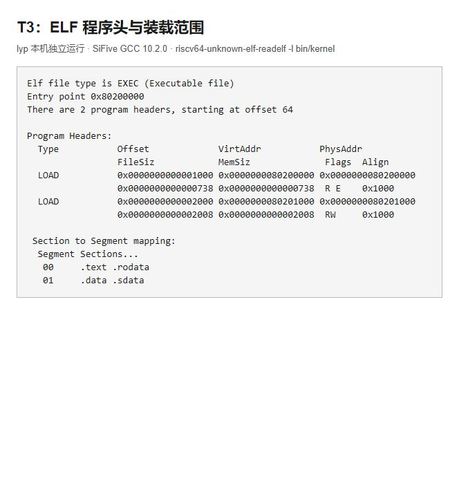

<center>图 10　ELF 入口和两个 LOAD 段的装载范围</center>

图中第一行入口为 `0x80200000`，两个 LOAD 段分别对应代码／只读数据和可写数据。程序头中的 `FileSiz/MemSiz` 本次相同，也与没有非空 BSS 的结果相符。

### 最终提示词

````markdown
[PROMPT]
任务：分析 code/tools/kernel.ld 与入口目标文件顺序，撰写 report/sections/T3-modules.md 的链接与内存布局模块。
操作要求：直接编辑真实报告文件，保留实验代码及其他成员章节。
输出要求：结合 nm、readelf 与 make print-kobjs，解释入口、段顺序、边界符号和装载地址；明确链接器与装载器的不同职责。

[RELY]
原样摘自 code/tools/kernel.ld（省略行尾注释）：
```ld
OUTPUT_ARCH(riscv)
ENTRY(kern_entry)

BASE_ADDRESS = 0x80200000;
```
```ld
    .text : {
        *(.text.kern_entry .text .stub .text.* .gnu.linkonce.t.*)
    }
```
```ld
    PROVIDE(edata = .);
```
```ld
    PROVIDE(end = .);
```

[GUARANTEE]
交付段布局表、etext/edata/end 的含义、ENTRY 与 BASE_ADDRESS 的区别、kern_entry 位于最前面的实际原因，以及验证命令和本次结果。

[SPECIFICATION]
## 链接布局分析
Pre-Condition：读取完整 kernel.ld、entry.S、Makefile 和 function.mk，已生成实际 ELF。
Post-Condition：说明当前 entry.S 使用普通 .text，entry.o 为链接输入的第一个目标文件；ENTRY 设置 ELF 入口，不自动重新排列代码。表中地址和边界与实际构建一致。
Case 1：PROVIDE 符号没有被引用、nm 未输出 etext 时，解释它仍表示脚本中 .text 末尾的位置，不补造符号表记录。
Requirements：不把段标志当成已经开启的页表权限；不把页对齐当成分页管理已实现；不修改链接脚本。
````

### 分析迭代过程

检查入口位置时，发现 `entry.S` 没有定义单独的 `.text.kern_entry`，于是继续看实际链接输入顺序，确认 `entry.o` 排在首位。报告据此补充了 `ENTRY` 与段排序的区别。BSS的说明也按本次符号表调整为零长度清零。

## 功能模块：格式化输出与 SBI 服务

**负责人：** 2414099－李云鹏（lyp）

### 模块功能描述

`kern_init` 调用 `cprintf("%s\n\n", message)` 后，加载提示便出现在终端上。沿着代码往下看，这次输出经过以下路径：

```text
cprintf → vcprintf → vprintfmt
  → cputch → cons_putc → sbi_console_putchar → sbi_call
    → ecall → OpenSBI控制台服务 → UART
```

主要函数为：

```c
int cprintf(const char *fmt, ...);
int vcprintf(const char *fmt, va_list ap);
void vprintfmt(void (*putch)(int, void *), void *putdat, const char *fmt, va_list ap);
static void cputch(int c, int *cnt);
void cons_putc(int c);
void sbi_console_putchar(unsigned char ch);
uint64_t sbi_call(uint64_t sbi_type, uint64_t arg0, uint64_t arg1, uint64_t arg2);
```

`cprintf` 用 `va_start` 取得变参，交给 `vcprintf`。`vcprintf` 准备字符计数器，再把 `cputch` 和计数器地址交给 `vprintfmt`。后者解析 `%s` 等格式，每得到一个字符就调用一次回调。`cputch` 输出字符后增加计数，`cons_putc` 再将字符转成 `unsigned char`，交给 SBI。

这一层回调让格式化与输出位置分开了：`vprintfmt` 只管生成字符，换一个回调就可以把结果写入内存缓冲区，项目中的 `vsnprintf` 正是这样复用它的。当前 `cprintf` 的通路没有字符缓冲队列，也没有把设备错误反馈为返回值；返回的计数是回调处理的字符数。

`sbi_console_putchar` 选择旧式 SBI 的字符输出调用号1。`sbi_call` 用内联汇编把调用号放到 `a7`，字符放到 `a0`，其余参数放到 `a1/a2`，最后执行 `ecall`。

执行 `ecall` 前，格式化和字符处理都在 S 态完成。陷入后，处理器记录异常原因和返回地址，进入 OpenSBI 的 M 态陷阱入口。固件保存现场、分发字符输出请求，再由控制台服务调用 UART 驱动。处理结束后恢复现场，返回到 `ecall` 的下一条内核指令，继续输出后续字符。

为观察这次调用，本机在 `0x80200492` 的 `ecall` 处断下，再单步进入固件，最后在下一条内核指令 `0x80200496` 处断下。

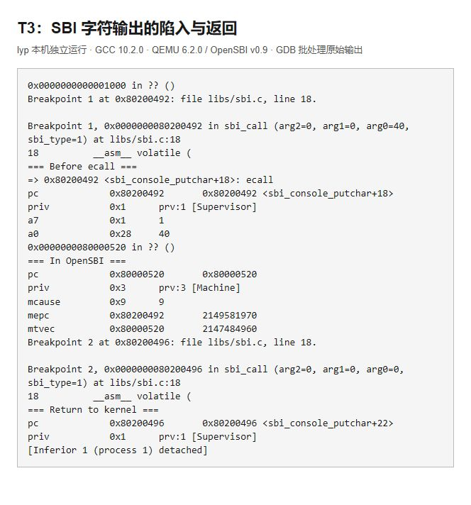

<center>图 11　字符输出时 S→M→S 的 GDB 批处理输出（QEMU 6.2.0 / OpenSBI v0.9）</center>

图中 `a7=1`、`a0=0x28`，表示请求输出字符 `(`。单步后 `priv` 从1变成3，`mcause=9`，`mepc` 记录 `0x80200492`，PC 到达 `mtvec` 指向的 `0x80000520`。返回内核时 PC 为 `0x80200496`，`priv` 又变成1。这组寄存器变化对应了一次完整的固件调用。

这里的 SBI 请求是 S态内核调用 M态固件，和用户程序的 U→S 系统调用不同。当前配置没有把 S态 `ecall` 委托回 S态，固件处理完请求后推进返回地址，再用 `mret` 回到内核。

本机 GCC 10.2.0 构建出的 `ecall` 在 `0x80200492`。核对时还发现 `vcprintf`、`sbi_call` 没有独立存活符号：它们的逻辑被 `-O2` 内联，剩余未使用节又被链接器删除，所以源码里的函数层次不一定都出现在最终调用栈中。

内核不能直接使用宿主环境的 `printf`，因为这里没有用户态C运行库及它依赖的文件、系统调用接口，构建也使用了 `-nostdlib/-nostdinc`。项目通过自己的格式化函数和 SBI 输出完成这项工作。

### 最终提示词

````markdown
[PROMPT]
任务：分析内核从 cprintf 到 ecall 的输出功能，撰写 T3 报告的输出模块。
操作要求：直接写入真实报告文件，不修改代码；按源码顺序说明每层职责。
输出要求：列出源码调用链，解释各层职责；只使用 lyp 自己实测产生的图片说明输出过程，不引用 T2 图片；区分源码关系与实测结果。

[RELY]
以下声明原样摘自 code/libs/stdio.h、code/kern/driver/console.h、code/libs/sbi.h：
```c
int cprintf(const char *fmt, ...);
int vcprintf(const char *fmt, va_list ap);
void vprintfmt(void (*putch)(int, void *), void *putdat, const char *fmt, va_list ap);
void cons_putc(int c);
void sbi_console_putchar(unsigned char ch);
```
以下函数原样摘自 code/libs/sbi.c：
```c
void sbi_console_putchar(unsigned char ch) {
    sbi_call(SBI_CONSOLE_PUTCHAR, ch, 0, 0);
}
```

[GUARANTEE]
交付 cprintf → vcprintf → vprintfmt → cputch → cons_putc → sbi_console_putchar → sbi_call → ecall 的源码调用关系、参数寄存器与陷入返回解释，以及不能直接使用宿主 printf 的原因。

[SPECIFICATION]
## 输出功能分析
Pre-Condition：读取 stdio.c、printfmt.c、console.c、sbi.c，结合 T2 的固件调试记录和本次反汇编。
Post-Condition：解释变参、回调与计数，在 S 态完成格式化，在当前固件配置下通过 S 态 ecall 进入 M 态；a7=1，a0 为字符；OpenSBI 最终输出，返回后继续内核执行。
Case 1：编译优化内联 vcprintf 或 sbi_call 时，保留源码逻辑链并标明 ELF 中不一定有独立函数符号。
Case 2：讨论 ecall 时，区分 S→M 的 SBI 调用与 U→S 的用户系统调用；不写成任意 ecall 必然进入 M 态。
Requirements：只说明本框架实际支持和使用的旧式 SBI console_putchar；不声称输出经过内核缓冲队列或输出计数就是硬件成功确认。
````

### 分析迭代过程

按源码整理调用链后，`nm` 中找不到 `vcprintf` 和 `sbi_call`。检查编译参数和 `sbi_console_putchar` 的反汇编，确认是内联与未使用节删除，因而在报告中分别说明源码关系和实际机器码。随后用图 11 的单步记录核对陷入和返回。


## 功能模块：构建与镜像加载

**负责人：** 2414099－李云鹏（lyp）

### 模块功能描述

执行 `make` 后，构建流程为：

```text
.c/.S → obj/.../*.o → bin/kernel → bin/ucore.img
```

`function.mk` 收集源文件并生成编译规则，Makefile把 kernel/libs 两组目标文件组成 `KOBJS`。`.S` 先由GCC预处理，因此能引用头文件中的栈大小宏。链接时，`ld -T tools/kernel.ld` 合并各节、确定地址和完成重定位，生成 ELF；`--gc-sections` 删除未使用的节。最后，`objcopy --strip-all -O binary` 生成裸镜像。

| 文件 | 内容 | 当前用途 |
|---|---|---|
| `bin/kernel` | ELF头、入口、程序头、装载内容和符号／调试信息 | QEMU按ELF装载，GDB读取符号 |
| `bin/ucore.img` | 内核内容字节及地址间隙的填充，无ELF元数据 | 原框架按指定地址加载的裸镜像 |

本次 `wc -c bin/ucore.img` 得到12296字节，即 `0x3008`，对应从 `0x80200000` 到 `0x80203008` 的跨度。ELF中还有头和调试信息，因此不能用它的文件大小直接表示内核占用的内存。

`make qemu` 仍然依赖 `ucore.img`，会先生成两个文件，但现在实际运行的参数是：

```sh
qemu-system-riscv64 -machine virt -nographic -bios default -kernel bin/kernel
```

这个修改来自T0：原来的 loader 只复制裸镜像，而 fw_dynamic 还需要有效的下一阶段入口。`-kernel` 让QEMU按ELF装载，并把入口信息提供给OpenSBI。练习2在PC还停在 `0x1000` 时就读到了内核入口指令，说明装载发生在虚拟CPU开始执行之前；OpenSBI随后完成初始化和特权级交接。

`make debug` 多加 `-s -S`，前者开启默认1234端口的GDB服务，后者让CPU启动时暂停；`make gdb` 读取 `bin/kernel` 的符号后连接QEMU。调试自编译固件时，两端传入相同的 `OPENSBI` 路径。

### 最终提示词

````markdown
[PROMPT]
任务：分析 Makefile/function.mk 从源文件到 ELF 和裸镜像的流程，补全 T3 构建模块及验证记录。
操作要求：直接修改真实报告文件，保留现有代码；在独立干净副本中编译运行。
输出要求：以当前 make 规则和 readelf 结果说明产物区别，结合 T0 解释当前 QEMU 加载方式；正文集中讲代码、观察和结果，环境调用故障留在任务文件。

[RELY]
原样摘自 code/Makefile：
```make
KOBJS	= $(call read_packet,kernel libs)
```
```make
$(UCOREIMG): $(kernel)
	$(OBJCOPY) $(kernel) --strip-all -O binary $@
```
```make
LDFLAGS	+= -nostdlib --gc-sections
```

[GUARANTEE]
交付 .c/.S→.o→bin/kernel→bin/ucore.img 的流程、ELF 与纯二进制区别、make qemu/debug/gdb 的含义及实测运行结论。

[SPECIFICATION]
## 构建和装载分析
Pre-Condition：已读取完整构建规则，并在已提交源码副本执行 make、readelf、make qemu。
Post-Condition：说明 .S 先预处理、目标文件重定位后形成 ELF；objcopy 生成不含 ELF 入口/符号表的裸镜像；当前 make qemu 仍依赖生成镜像，但实际 -kernel 加载 bin/kernel。
Case 1：看到旧式 loader 相关注释时，说明这是历史方案，不当作当前执行命令。
Case 2：make qemu 因 kern_init 的无限循环被 timeout 停止时，记录输出与预期退出码，不把超时误判为启动失败或测试全面通过。
Requirements：说明 lab1 缺少 tools/grade.sh，make grade 不适用；不得声称在本机验证了未运行的 QEMU 版本。
````

### 验证结果

本机使用 WSL Ubuntu-22.04-OS、SiFive GCC 10.2.0、QEMU 6.2.0和OpenSBI v0.9，在已提交代码的独立副本中完成构建，并检查了ELF头、段表和符号表。运行 `timeout 8 make qemu` 得到：

```text
OpenSBI v0.9
Domain0 Next Address      : 0x0000000080200000
Domain0 Next Mode         : S-mode
(THU.CST) os is loading ...
```

加载提示输出后，内核按源码进入无限循环，8秒后由 `timeout` 停止，退出码为124。框架没有 `tools/grade.sh`，Lab1不执行 `make grade`。

构建分析主要依据 `Makefile`、`tools/function.mk`、`tools/kernel.ld`；输出分析依据 `stdio.c`、`printfmt.c`、`console.c`、`sbi.c`。指导书的[项目组成与执行流](http://8.135.34.58/lab2026/_book/lab1/lab1_2_2_file.html)用于核对任务范围。


> **【待补】拓展：现代笔记本的启动流程（T6，nagilix）** <!-- fill:T6-*extend*.md -->


# 五、测试与验证

> **【待补】make qemu 运行截图（T6，nagilix）** <!-- fill:T6-*test*.md -->


# 六、实验总结与收获

## 对操作系统的理解

**负责人：** 2414099－李云鹏（lyp）

### 1. 实验知识点与OS原理的对应

这次内核只打印了一条加载提示，之后就在循环里停住了。但从复位到这条输出，需要固件、入口汇编、链接布局和SBI接口一起配合。对照原理知识时，我们主要关注这些已经在代码和调试中出现的机制。

| 实验中的知识点 | 对应原理及二者的关系 |
|---|---|
| 复位代码 → OpenSBI → 内核入口 | 对应系统引导。原理中的阶段交接在这里表现为PC和特权级的变化。本配置由QEMU提前装载ELF，OpenSBI完成固件初始化与交接，实验没有实现从磁盘读取内核的引导程序。 |
| 内核在S态，通过 `ecall` 请求M态固件输出 | 对应特权级和受控调用。CPU记录异常原因和返回位置，固件处理后返回。它与用户系统调用的机制有关，但调用者和服务者不同：这里是S→M，还没有U态用户程序。 |
| 设置启动栈，按ABI进入C函数 | 对应执行上下文与栈。保存返回地址、局部数据等操作都需要可访问的栈；但当前只有启动栈，没有进程独立内核栈和上下文切换。 |
| 链接脚本排列代码与数据，启动时清零BSS | 对应程序布局和运行时初始化。链接器确定各部分地址，启动代码满足静态变量零初始化要求。本次BSS为空；页对齐和ELF段标志也没有自动建立页表保护。 |
| 编译、链接、生成镜像，再由QEMU装载 | 对应程序装入。ELF的程序头和入口为装载提供信息，裸镜像则需要外部指定地址。这次装入的是内核，还没有用户进程的加载和 `exec`。 |
| 格式化回调 → 控制台接口 → SBI → UART | 对应分层设计和设备抽象。格式化函数负责生成字符，固件负责访问串口。当前通路逐字符输出，没有内核缓冲队列或异步I/O管理。 |

其中最容易混淆的是页对齐与分页。代码里出现 `PGSIZE=4096`，栈也按页对齐，但入口处 `satp=0`，内核没有建立页表。这里的“页”先用于描述布局粒度，还没有承担地址转换和进程隔离的作用。

异常处理也要区分固件和内核。字符输出已经通过 `ecall` 触发了异常，OpenSBI负责处理；尚未实现的是内核自己的时钟中断、页故障等处理逻辑。因此，“内核还没有中断处理代码”不能写成“整个实验没有发生异常”。

### 2. 本实验没有覆盖的重要知识点

- **内存分配和虚拟内存。** 启动栈是静态预留的，没有空闲页管理、动态分配、页表、缺页处理和换页机制。
- **进程、线程与调度。** 没有PCB、运行队列、进程创建退出及上下文切换。`kern_init` 末尾的循环持续占用CPU，不等于休眠或调度空闲任务。
- **用户态与系统调用。** 没有加载用户程序，也没有系统调用分发、用户参数检查。现有SBI接口服务的是内核对固件的请求。
- **内核中断与完整设备管理。** `kbd_intr`、`serial_intr`、`cons_init` 都是空函数。虽然可以经固件输出字符，内核仍没有实现设备中断、DMA、请求队列及完成通知。
- **同步和通信。** 当前启动执行流没有使用锁、信号量或条件变量，也没有进程间通信。本次单hart运行不能验证多核并发。
- **文件系统与持久化。** 没有文件、目录、块分配和磁盘读写管理。`ucore.img` 是裸内核镜像，不是文件系统镜像。

这些内容需要在后续实验中逐步补齐。Lab1能验证的是内核已经获得控制权、具有可用的启动栈，并能通过固件输出字符；它距离能运行用户程序的操作系统还有不少工作。

本节依据当前 `init.c`、`entry.S`、`console.c`、`kernel.ld` 以及T1—T3的分析。最终提示词见 prompt.md。


> **【待补】AI 协作开发的经验（T6，nagilix 起草，全员补充）** <!-- fill:T6-*summary*.md -->
