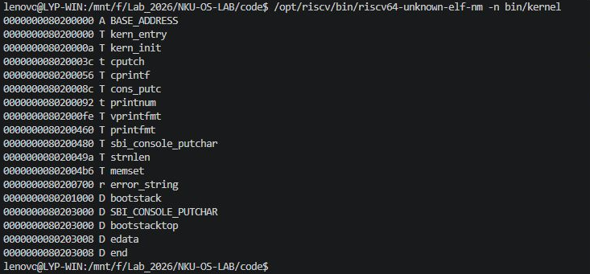
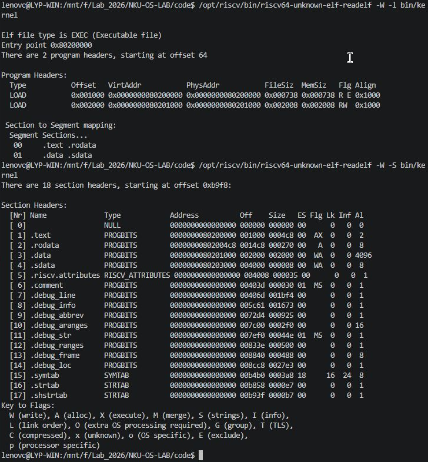
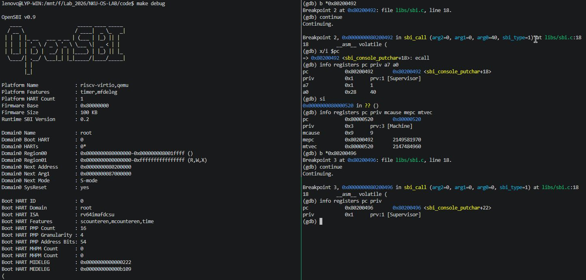

## 核心模块理解

**负责人：** 2414099－李云鹏（lyp）

### 功能模块：链接脚本与内核内存布局

链接脚本`kernel.ld` 把各目标文件的代码和数据组织成内核 ELF，确定入口及各段的地址。

```ld
OUTPUT_ARCH(riscv)
ENTRY(kern_entry)

BASE_ADDRESS = 0x80200000;
```

`ENTRY(kern_entry)` 指定 ELF 的入口字段，`. = BASE_ADDRESS` 则让接下来的 `.text` 从 `0x80200000` 开始。二者不是同一件事：入口字段告诉装载器从哪里执行，位置计数器决定链接布局。

为什么 `kern_entry` 恰好在最前面？`entry.S` 使用的是普通 `.text`，而 `make print-kobjs` 输出的第一个文件是 `obj/kern/init/entry.o`，之后才是 `init.o`、`stdio.o` 等。链接器收集这些输入节时，先放入 `entry.o` 的入口代码，所以 `kern_entry` 的地址就是 `.text` 的起点。仅有 `ENTRY` 并不会把这个函数移到最前面。

脚本的安排顺序是 `.text → .rodata → 页对齐 → .data → .sdata → .bss` 。用 SiFive GCC 10.2.0 构建后，`readelf -S` 和 `nm` 的结果如下：

| 区域 | 地址范围（左闭右开） | 本次内容 |
|---|---|---|
| `.text` | `[0x80200000,0x802004c8)` | 入口和函数机器码 |
| `.rodata` | `[0x802004c8,0x80200738)` | 字符串和格式化所需的只读数据 |
| 对齐空隙 | `[0x80200738,0x80201000)` | 后续数据按4 KiB对齐 |
| `.data` | `[0x80201000,0x80203000)` | 8 KiB启动栈 |
| `.sdata` | `[0x80203000,0x80203008)` | `SBI_CONSOLE_PUTCHAR` |
| BSS清零区间 | `[0x80203008,0x80203008)` | 空区间，`edata=end` |

下面的 `nm` 输出中可以直接核对入口、栈和数据边界。



<center>图 T3-1　kern_entry、启动栈和数据边界的符号地址</center>

使用 `readelf -W -l bin/kernel` 查看内核 ELF 文件的程序头表，可以发现其中包含两个 `LOAD` 段。第一个段的起始物理地址为 `0x80200000`，包含 `.text` 和 `.rodata` 节，具有可读、可执行属性；第二个段的起始物理地址为 `0x80201000`，包含 `.data` 和 `.sdata` 节，具有可读、可写属性。通过 `readelf -W -S bin/kernel` 查看节头表，可以进一步验证各节的具体地址及其布局。此外，两个装载段的虚拟地址与物理地址相同。由于内核入口处 `satp=0`，说明当前仍处于未启用分页的 Bare 模式，因此这些地址直接对应物理内存，ELF 中的段权限也尚未通过页表落实为内存访问权限。



<center>图 T3-2　ELF 入口、两个 LOAD 段及节表</center>

### 功能模块：格式化输出与 SBI 服务

`kern_init` 调用 `cprintf("%s\n\n", message)` 后，加载提示便出现在终端上。沿着代码往下看，这次输出经过以下路径：

```text
cprintf → vcprintf → vprintfmt
  → cputch → cons_putc → sbi_console_putchar → sbi_call
    → ecall → OpenSBI控制台服务 → UART
```

主要函数为：

```c
int cprintf(const char *fmt, ...);
int vcprintf(const char *fmt, va_list ap);
void vprintfmt(void (*putch)(int, void *), void *putdat, const char *fmt, va_list ap);
static void cputch(int c, int *cnt);
void cons_putc(int c);
void sbi_console_putchar(unsigned char ch);
uint64_t sbi_call(uint64_t sbi_type, uint64_t arg0, uint64_t arg1, uint64_t arg2);
```

`cprintf` 首先通过 `va_start` 获取可变参数，再将格式字符串和参数交给 `vcprintf`。`vcprintf` 初始化字符计数器，并调用 `vprintfmt` 进行格式化处理。`vprintfmt` 负责解析 `%s` 等格式说明符，每生成一个字符，就调用回调函数 `cputch`。`cputch` 通过 `cons_putc` 将字符交给 SBI 输出，同时将字符计数加一。

采用回调函数的好处是将**格式化处理与实际输出分离**。`vprintfmt` 只负责生成字符，具体输出到哪里由回调函数决定。例如，`cprintf` 将字符输出到控制台，而 `vsnprintf` 则复用相同的格式化逻辑，将字符写入内存缓冲区。`cprintf` 最终返回的是已处理的字符数，而非设备实际成功输出的字符数。

`sbi_console_putchar` 选择旧式 SBI 的字符输出调用号1。`sbi_call` 用内联汇编把调用号放到 `a7`，字符放到 `a0`，其余参数放到 `a1/a2`，最后执行 `ecall`。

执行 `ecall` 前，格式化和字符处理都在 S 态完成。陷入后，处理器记录异常原因和返回地址，进入 OpenSBI 的 M 态陷阱入口。固件保存现场、分发字符输出请求，再由控制台服务调用 UART 驱动。处理结束后恢复现场，返回到 `ecall` 的下一条内核指令，继续输出后续字符。

为观察这次调用，本机在 `0x80200492` 的 `ecall` 处断下，再单步进入固件，最后在下一条内核指令 `0x80200496` 处断下。



<center>图 T3-3　VSCode 终端中字符输出时 S→M→S 的 GDB 单步调试（QEMU 6.2.0 / OpenSBI v0.9）</center>

图中 `a7=1`、`a0=0x28`，表示请求输出字符 `(`。单步后 `priv` 从1变成3，`mcause=9`，`mepc` 记录 `0x80200492`，PC 到达 `mtvec` 指向的 `0x80000520`。返回内核时 PC 为 `0x80200496`，`priv` 又变成1。左栏此时出现了一个 `(`，与 `a0` 的字符值一致。这组寄存器变化对应了一次完整的固件调用。

### 功能模块：构建与镜像加载

执行 `make` 后，构建流程为：

```text
.c/.S → obj/.../*.o → bin/kernel → bin/ucore.img
```

`function.mk` 收集源文件并生成编译规则，Makefile把 kernel/libs 两组目标文件组成 `KOBJS`。`.S` 先由GCC预处理，因此能引用头文件中的栈大小宏。链接时，`ld -T tools/kernel.ld` 合并各节、确定地址和完成重定位，生成 ELF；`--gc-sections` 删除未使用的节。最后，`objcopy --strip-all -O binary` 生成裸镜像。

| 文件 | 内容 | 当前用途 |
|---|---|---|
| `bin/kernel` | ELF头、入口、程序头、装载内容和符号／调试信息 | QEMU按ELF装载，GDB读取符号 |
| `bin/ucore.img` | 内核内容字节及地址间隙的填充，无ELF元数据 | 原框架按指定地址加载的裸镜像 |

 `wc -c bin/ucore.img` 得到12296字节，即 `0x3008`，对应从 `0x80200000` 到 `0x80203008` 的跨度。ELF中还有头和调试信息，因此不能用它的文件大小直接表示内核占用的内存。

`make debug` 多加 `-s -S`，前者开启默认1234端口的GDB服务，后者让CPU启动时暂停；`make gdb` 读取 `bin/kernel` 的符号后连接QEMU。调试自编译固件时，两端传入相同的 `OPENSBI` 路径。
